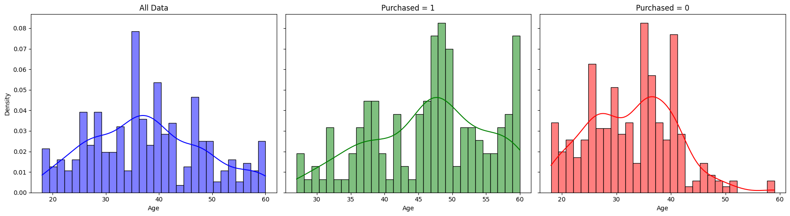

# Customer Behavior Analysis and Personalized Messaging System

This project aims to study the consumer profiles of different customers who either purchase or do not purchase a given product and, based on their distinct characteristics, develop a method that generates personalized messages in order to promote a discount for each specific group.

## Table of Contents

- [Installation](#installation)
- [Usage](#usage)
- [Results](#results)
- [License](#license)
- [Contact](#contact)

## Installation

```bash
# Clone the repository
git clone https://github.com/joao-pedro-afonso/costumer-messages.git
cd costumer-messages

# Install dependencies
pip install -r requirements.txt
```

## Project's Structure

This project has 4 different folders:

- data: csv file with the dataset. This dataset can also be obtained on: https://www.kaggle.com/datasets/denisadutca/customer-behaviour
- notebooks: where you can find three different applications.
    - costumer_analysis.ipynb: the Exploratory Data Analysis that enables us to study the costumer behaviour
    - messages.ipynb: segment the clients in groups and generate messages with gpt-4o-mini based on their features
    - test_functions.ipynb: unit testing of the functions developed
- results: containes a txt file with the messages generated and the histograms generated
- src: python files with the functions needed

## Results

Through the histograms we get to know the consumer profiles. For example, it is possible to see the distribution of the Age of our clients, as well as the age of the clients that purchased and did not purchase our product.



Furthermore, below it is possible to observe one example of a message generated by this method.

```bash
# Group of Clients
Gender: Male, Age: 18-33 (young), Salary: 15000-52000 (low)

# Output
Hey there! 🤙 We know you love staying on top of trends, so we're excited to offer you an exclusive discount on [Product]! Upgrade your collection now and enjoy a special deal just for you. Don't miss out – this is your chance to grab it at a great price! 🛒✨

```

## License

This project is licensed under the [MIT License](LICENSE).

## Contact

João Afonso - [jpcdma@gmail.com](mailto:jpcdma@gmail.com)
